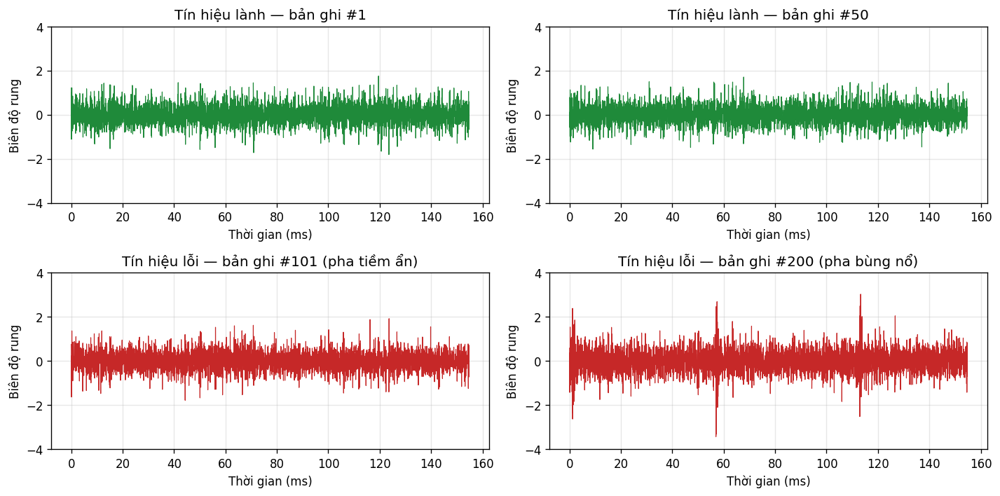
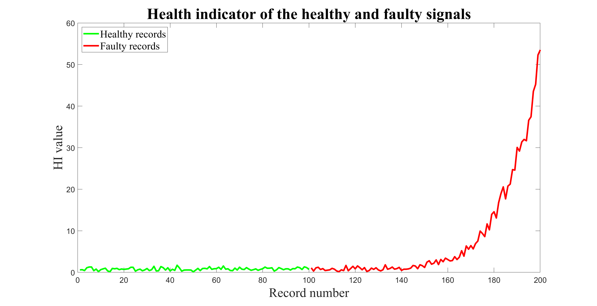

# BÁO CÁO BÀI THỰC HÀNH

## Chạy thử pipeline xử lý tín hiệu rung và làm quen với chẩn đoán lỗi bánh răng

| | |
|---|---|
| Lớp / Nhóm | ITD-Lab — Nhóm NCS |
| Học viên | *(điền tên)* |
| Giảng viên hướng dẫn | TS. Trọng Du |
| Bài thực hành | Angular Resampling và Pipeline Chẩn đoán Bánh răng |
| Ngày nộp | 29/04/2026 |
| Mã nguồn tham khảo | Matania O. *et al.*, *“Signal Processing for the Condition-Based Maintenance of Rotating Machines via Vibration Analysis: A Tutorial”*, **MDPI Sensors** 24(2), 454 (2024). |

---

## 1. Mục tiêu của bài thực hành

Bài thực hành yêu cầu cài MATLAB và chạy thử hai script demo lấy từ tutorial của Matania *et al.* (2024), gồm:

- `demo_angular_resampling.m` — minh họa kỹ thuật lấy mẫu lại trong miền góc, đây là nội dung đã học hôm trước.
- `demo_gear_diagnosis.m` — áp dụng kỹ thuật này vào một pipeline chẩn đoán lỗi bánh răng đầy đủ.

Hai mục tiêu chính của bài là:

- Chạy được code, xuất hình kết quả để nộp.
- Đọc các hàm `angular_resampling.m`, `calc_sa.m`, `calc_difference_signal.m` để hiểu mỗi bước trong pipeline làm gì.

Trọng tâm chính là khối angular resampling vì đó là phần học hôm trước; các khối còn lại (synchronous averaging, difference signal, health indicator) được trình bày ngắn gọn hơn nhằm giúp hình dung toàn bộ pipeline chẩn đoán hoạt động ra sao.

---

## 2. Tổ chức code và dữ liệu

### 2.1 Các tệp trong thư mục

- `demo_gear_diagnosis.m` — script chính. Nạp dữ liệu, gọi tuần tự ba hàm con, vẽ đồ thị HI.
- `demo_angular_resampling.m` — demo angular resampling trên một tín hiệu chirp tổng hợp, không cần file dữ liệu ngoài.
- `angular_resampling.m`, `calc_sa.m`, `calc_difference_signal.m` — ba hàm xử lý mà script chính gọi.
- `Data/demo_gear_diagnosis.mat` — tệp dữ liệu (lấy từ link Dropbox của thầy).

Cách tổ chức tách biệt giữa script điều phối và các hàm xử lý giúp dễ đọc và dễ thử thay từng khối khi muốn cải tiến.

### 2.2 Nội dung tệp .mat

Tệp `demo_gear_diagnosis.mat` chứa 5 biến:

- `sigs_healthy_t` — ma trận tín hiệu rung của các bản ghi lành, mỗi cột là một bản ghi.
- `sigs_faulty_t` — tương tự cho các bản ghi lỗi.
- `speed_healthy`, `speed_faulty` — tốc độ trục tức thời (đơn vị vòng/giây).
- `dt` — bước thời gian lấy mẫu.

Kiểm tra trực tiếp tệp cho ra các thông số:

| Thông số | Giá trị |
|---|---|
| `dt` | 38.70 µs (tương ứng $f_s \approx 25.84$ kHz) |
| Số mẫu/bản ghi | 24,548 (mỗi bản ghi dài $\approx 0.95$ s) |
| Số bản ghi lành | 100 |
| Số bản ghi lỗi | 100 |
| Vận tốc trục | 17.8947 rps ($\approx 1074$ RPM), không đổi cho mọi bản ghi |
| Số răng $z$ (gear mesh) | 38, khai báo cứng trong script |
| Số vòng quay/bản ghi | $\approx 17$ vòng |

Có một điểm đáng chú ý: vận tốc trong bộ dữ liệu này là cố định cho mọi bản ghi, không biến thiên. Lúc đầu thấy hơi lạ vì angular resampling thường được giới thiệu là kỹ thuật cho tốc độ thay đổi. Tuy nhiên kể cả khi tốc độ cố định, nó vẫn có ích: $f_s/\omega = 25840/17.8947 \approx 1443.99$ — không phải số nguyên. Nếu chia tín hiệu thời gian thành các đoạn dài 1444 mẫu rồi trung bình thì sau khoảng 17 vòng, các vòng sẽ lệch pha một phần mẫu so với nhau. Angular resampling ép số mẫu/vòng thành đúng 1444, đảm bảo phép trung bình đồng bộ ở bước sau khớp pha hoàn hảo.

Hình dưới so sánh nhanh tín hiệu thô của vài bản ghi lành và lỗi:



Hai bản ghi lành nhìn gần như giống hệt nhau, độ lặp lại cao. Bản ghi lỗi #101 không phân biệt được với lành bằng mắt thường — phù hợp với việc HI của bản ghi này nằm trong dải lành (xem mục 5.2). Chỉ ở bản ghi #200 mới thấy rõ các xung va đập đặc trưng cho răng mẻ. RMS thô của tập lỗi cũng chỉ cao hơn lành khoảng 22% ngay cả ở giai đoạn nặng — không đủ để chẩn đoán đáng tin cậy nếu chỉ nhìn biên độ. Đây là lý do cần pipeline xử lý sâu hơn.

### 2.3 Cách script chính chạy

`demo_gear_diagnosis.m` nạp dữ liệu một lần, sau đó chạy hai vòng lặp:

- Vòng 1 trên 100 bản ghi lành: tính 4 đặc trưng cho mỗi bản ghi, sau đó lấy trung bình $\boldsymbol{\mu}$ và độ lệch chuẩn $\boldsymbol{\sigma}$ của 4 đặc trưng đó. Đây đóng vai trò "chuẩn lành" để các bản ghi lỗi so sánh.
- Vòng 2 trên 100 bản ghi lỗi: cũng tính 4 đặc trưng, rồi tính chỉ số HI dựa trên $\boldsymbol{\mu}, \boldsymbol{\sigma}$ ở trên.

Một điểm hay là pipeline chỉ học từ tập lành, không cần nhãn lỗi — tức đây là bài toán phát hiện bất thường (anomaly detection). Cách này phù hợp với thực tế công nghiệp vì dữ liệu lỗi gắn nhãn thường rất khan hiếm.

---

## 3. Khối lấy mẫu lại trong miền góc — `angular_resampling.m`

Đây là khối học hôm trước nên ghi chú kỹ hơn các khối còn lại.

### 3.1 Vấn đề cần giải quyết

Tín hiệu rung trên một máy quay gồm nhiều thành phần điều hòa khoá pha với tốc độ trục. Một thành phần bậc $k$ có dạng:

$$x_k(t) = A_k \cos\big(2\pi k\,\varphi(t) + \phi_0\big),\quad \varphi(t)=\int_0^t\omega(\tau)\,d\tau,$$

với $\omega(t)$ là vận tốc trục tức thời (vòng/giây) và $\varphi(t)$ là pha tích lũy (đơn vị: vòng). Tần số tức thời thu được bằng đạo hàm của pha:

$$f_k(t) = \frac{1}{2\pi}\frac{d}{dt}\big[2\pi k\,\varphi(t)\big] = k\,\omega(t).$$

Khi $\omega(t)$ thay đổi theo thời gian, $f_k(t)$ cũng thay đổi — $x_k(t)$ là một tín hiệu chirp. Áp FFT trên cửa sổ $[0,T]$, năng lượng tập trung tại đỉnh duy nhất $f=k\omega_0$ chỉ khi tốc độ cố định $\omega(t)\equiv\omega_0$. Khi tốc độ biến thiên, năng lượng bị trải trên toàn bộ dải $[k\,\omega_{min},\, k\,\omega_{max}]$. Mật độ phổ tại tần số $f$ xấp xỉ tỉ lệ với $1/|df_k/dt|$ — chỗ tốc độ thay đổi nhanh thì mật độ thấp, chỗ thay đổi chậm thì mật độ cao. Đây là *spectral smearing*.

Hệ quả của smearing với bài toán chẩn đoán có thể chia thành hai mặt. Thứ nhất, các đỉnh đặc trưng cho hư hỏng cục bộ vốn đã yếu so với rung "bình thường" của ăn khớp răng, khi bị trải ra thì biên độ phổ giảm thêm nữa, dễ bị nhiễu nền nuốt chửng. Thứ hai, các phép xử lý tiếp theo của pipeline — trung bình đồng bộ và difference signal — đều dựa trên giả thiết tín hiệu có chu kỳ cố định trong miền xử lý. Nếu tốc độ thay đổi thì không có chu kỳ cố định trên trục thời gian, các phép này không áp dụng được một cách đúng đắn.

### 3.2 Ý tưởng — chuyển sang miền góc

Vì $\omega(t)>0$, hàm $\varphi(t)$ đơn điệu tăng nên có hàm ngược $t(\varphi)$. Định nghĩa tín hiệu trên miền góc:

$$y(\varphi) = x\big(t(\varphi)\big).$$

Áp công thức trên cho thành phần điều hòa bậc $k$:

$$y_k(\varphi) = A_k\cos\big(2\pi k\,\varphi + \phi_0\big).$$

Đây là sinusoid thuần khiết theo $\varphi$, không còn phụ thuộc $\omega(t)$. "Tần số" trên trục $\varphi$ gọi là *bậc* (order), đơn vị là chu kỳ/vòng. Áp FFT lên $y(\varphi)$ cho ra phổ bậc với các đỉnh sắc nét tại các bậc nguyên: bậc 1 cho mất cân bằng trục, bậc $z$ cho ăn khớp răng, các bậc $z\pm 1, z\pm 2,\dots$ cho sidebands.

Với xử lý số, $\omega(t)$ và $x(t)$ đều được lấy mẫu rời rạc theo bước $\Delta t$. Để thu được $y$ trên lưới góc đều $\{\varphi_m = m\Delta\varphi\}$, cần ba bước:

1. Tính $\varphi$ tại các điểm thời gian đã có $\to$ thu được các cặp $(t_n,\varphi_n)$.
2. Với mỗi $\varphi_m$ trên lưới góc đều, tìm $t_m$ sao cho $\varphi(t_m)=\varphi_m$ (đảo ánh xạ). Vì $\varphi_n$ đơn điệu nên dùng nội suy 1D là đủ.
3. Lấy mẫu $x$ tại $t_m$: $y_m = x(t_m)$. Vì $t_m$ thường không trùng với lưới mẫu thời gian, cần nội suy $x$.

Điều kiện Nyquist trong miền góc: $\Delta\varphi < 1/(2k_{max})$ với $k_{max}$ là bậc cao nhất cần biểu diễn, tương đương $F_{cyc}=1/\Delta\varphi > 2k_{max}$. Đối chiếu với Nyquist gốc trên trục thời gian $\Delta t < 1/(2f_{max}) = 1/(2k_{max}\omega(t))$, tại điểm tốc độ thấp nhất $\omega_{min}$ ràng buộc lỏng nhất: $\Delta t < 1/(2k_{max}\omega_{min})$. Suy ngược, $k_{max} < 1/(2\Delta t\,\omega_{min})$, tức $F_{cyc}$ tối đa hợp lý là $1/(\Delta t\,\omega_{min})$ — đúng công thức của hàm `angular_resampling.m` ở dòng (4). Chọn $\omega_{min}$ làm tham chiếu vì đây là điểm "bí" nhất về Nyquist; các điểm có tốc độ cao hơn thì dư mẫu, không vi phạm.

### 3.3 Code và giải thích

Đoạn code chính của hàm:

```matlab
function [sig_cyc, cyc_fs, sample_pnts] = angular_resampling(t, speed, sig_t)

dt = t(2) - t(1);                                                 % (1)
cumulative_phase = cumsum(speed*dt);                              % (2)
cumulative_phase = cumulative_phase - cumulative_phase(1);        % (3)

cyc_fs = ceil(1/dt/min(speed));                                   % (4)

constant_phase_intervals = linspace(0, max(cumulative_phase), ...
                  round(cyc_fs*max(cumulative_phase)))';          % (5)
times_of_constant_phase_intervals = ...
    interp1(cumulative_phase, t, constant_phase_intervals, 'linear');  % (6)

sig_cyc = interp1(t, sig_t, times_of_constant_phase_intervals, 'spline'); % (7)
```

Giải thích từng dòng:

- **(1)** Lấy bước thời gian từ chính véc-tơ thời gian, ngầm định lưới đều.
- **(2)** Tính pha tích lũy bằng tổng cộng dồn — xấp xỉ rời rạc của tích phân $\int\omega\,d\tau$. Vì `speed` ở đơn vị vòng/giây nên pha có đơn vị vòng.
- **(3)** Đặt pha gốc về 0. Không bắt buộc nhưng tiện cho bước sau.
- **(4)** Chọn tần số lấy mẫu trong miền góc bằng số mẫu/vòng tại tốc độ thấp nhất. Lý do: tại tốc độ thấp nhất, số mẫu thời gian phân bổ cho 1 vòng là lớn nhất, nên dùng làm chuẩn thì các đoạn tốc độ cao hơn vẫn đủ mẫu, không vi phạm Nyquist.
- **(5)** Tạo lưới góc đều với $F_{cyc}$ mẫu/vòng.
- **(6)** Với mỗi điểm góc $\varphi_m$ trên lưới, tìm thời điểm $t_m$ tương ứng. Vì $\varphi(t)$ đơn điệu tăng nên dùng `interp1` với vai trò input/output đảo ngược là được, với phương pháp `'linear'` đủ tốt vì hàm đơn điệu.
- **(7)** Lấy mẫu tín hiệu rung tại các $t_m$ vừa tìm được. Dùng `'spline'` thay vì `'linear'` để giữ được các thành phần tần số cao — cần thiết vì xung va đập do hư hỏng có phổ rộng.

Hai lựa chọn nội suy "linear-then-spline" ở (6) và (7) có lý do riêng. Ở (6), hàm $\varphi(t)$ đơn điệu tăng và trơn (vì là tích phân của một hàm trơn dương), nội suy linear không gây sai số đáng kể vì giữa hai điểm liên tiếp $\varphi$ gần như tuyến tính. Nếu dùng spline ở đây có thể tạo ra overshoot không cần thiết. Ở (7), tín hiệu rung $x(t)$ có thể chứa các thành phần tần số cao gần Nyquist (do xung va đập của hư hỏng có phổ rộng). Bộ lọc tương đương của nội suy linear có đáp ứng tần số dạng $\text{sinc}^2$, suy giảm khoảng 6 dB/oct, làm "xước" các thành phần tần số cao. Spline (cubic) có đáp ứng phẳng hơn nhiều ở vùng tần số cao, giữ được các thành phần này tốt hơn — quan trọng vì chúng chính là dấu vết của hư hỏng.

Một nhận xét nhỏ: cách dùng `cumsum` ở (2) là xấp xỉ Euler tiến với sai số $O(\Delta t)$. `cumtrapz` (xấp xỉ trapezoidal) có sai số $O(\Delta t^2)$, chính xác hơn mà chi phí tính toán không tăng đáng kể. Trong bộ dữ liệu này tốc độ không đổi nên sai số tích lũy không đáng kể, nhưng với dữ liệu có tốc độ biến thiên mạnh thì nên đổi.

---

## 4. Hai khối còn lại trong pipeline

### 4.1 `calc_sa.m` — trung bình đồng bộ

```matlab
function [sa] = calc_sa(sig_cyc, sa_len)

num_sgmnts = floor(length(sig_cyc)/sa_len);
sig_cyc = sig_cyc(1:num_sgmnts*sa_len);
sigs_mtrx = reshape(sig_cyc, sa_len, num_sgmnts);

sa = mean(sigs_mtrx, 2);
```

Hàm cắt tín hiệu thành các đoạn dài đúng `sa_len` mẫu (= 1 vòng quay sau angular resampling), reshape thành ma trận, lấy trung bình theo cột để được 1 vòng đại diện. Có thể chứng minh ngắn gọn vì sao phép trung bình này hoạt động như một bộ lọc lược trên trục bậc.

Giả sử tín hiệu $y[m]$ trong miền góc gồm hai loại thành phần:

- *Thành phần đồng bộ* với trục có dạng $a\cos(2\pi k\,m/N_r + \theta)$ với $k$ là số nguyên, $N_r$ là số mẫu/vòng. Khi cắt theo từng vòng và đánh số vòng $r=0,1,\dots,R-1$:
  $$y_r[n] = a\cos\!\Big(2\pi k(rN_r+n)/N_r + \theta\Big) = a\cos(2\pi kn/N_r + \theta + 2\pi kr) = a\cos(2\pi kn/N_r + \theta).$$
  Phase shift $2\pi kr$ là bội của $2\pi$, không thay đổi giá trị. Trung bình qua các vòng cho ra chính bản thân nó.

- *Thành phần phi đồng bộ* có dạng tương tự nhưng với $k$ không phải số nguyên. Khi đó phase shift $2\pi kr$ phân bố đều trên $[0,2\pi)$ khi $r$ chạy, các vector $e^{j2\pi kr}$ "trải đều" trên đường tròn đơn vị, và trung bình của chúng tiệm cận 0 với tốc độ $\sim 1/R$ (cho thành phần xác định) hoặc $\sim 1/\sqrt{R}$ (cho nhiễu trắng).

Cụ thể, với nhiễu trắng có phương sai $\sigma^2$, phép trung bình qua $R$ vòng cho ra tín hiệu có phương sai $\sigma^2/R$ — tức biên độ nhiễu giảm theo $\sqrt{R}$. Trong bộ dữ liệu này $R\approx 17$, nên biên độ nhiễu trắng giảm khoảng $\sqrt{17}\approx 4.1$ lần (tăng SNR khoảng 12 dB). Đây là lý do SA hữu ích kể cả khi đã có angular resampling.

Hàm này phụ thuộc hoàn toàn vào việc `sa_len` là số mẫu/vòng *chính xác* — đây là lý do nó phải đi kèm với angular resampling, không thể tách rời. Nếu `sa_len` lệch dù chỉ một mẫu, các vòng sẽ phase-shift dần và các thành phần đồng bộ cũng bị triệt tiêu cùng với nhiễu — phá vỡ hoàn toàn mục đích của phép trung bình.

### 4.2 `calc_difference_signal.m` — tín hiệu hiệu

Tín hiệu trung bình đồng bộ chứa các thành phần nào? Có thể liệt kê:

- Hài của trục: bậc 1, 2, 3,... do mất cân bằng và lệch tâm.
- Hài của ăn khớp răng: bậc $z, 2z, 3z,...$ với $z=38$ là số răng.
- Sidebands quanh các hài ăn khớp: bậc $z\pm 1, z\pm 2,\dots, 2z\pm 1, 2z\pm 2,\dots$

Sự xuất hiện của sidebands có nguồn gốc từ điều biến biên độ. Lý tưởng, biên độ của thành phần ăn khớp răng phải cố định trong suốt 1 vòng quay. Thực tế, do sai số chế tạo (răng không hoàn toàn giống nhau), lệch tâm trục, và độ võng của răng dưới tải, biên độ bị điều biến với chu kỳ 1 vòng:

$$x_{GM}(\varphi) = A(\varphi)\cdot\cos(2\pi z\varphi),$$

với $A(\varphi)$ là hàm chu kỳ 1 vòng. Khai triển $A(\varphi)$ theo chuỗi Fourier $A(\varphi)=\sum_n a_n e^{j2\pi n\varphi}$ và áp công thức tích sang tổng:

$$x_{GM}(\varphi) = \sum_n a_n \cdot \frac{1}{2}\Big[\cos\big(2\pi(z+n)\varphi\big) + \cos\big(2\pi(z-n)\varphi\big)\Big].$$

Đây chính là các đỉnh ở bậc $z, z\pm 1, z\pm 2,\dots$ — đỉnh chính ở $z$ và các sidebands cách đều khoảng cách 1. Biên độ giảm dần theo $|n|$ vì $|a_n|$ thường giảm dần trong khai triển Fourier của hàm trơn. Đó là lý do vì sao chỉ cần loại $K=2$ sidebands mỗi bên đã đủ — các đỉnh xa hơn đã rất nhỏ.

Stewart (1977) đề xuất: loại bỏ tất cả các thành phần "bình thường" này khỏi tín hiệu trung bình đồng bộ, chỉ giữ phần dư. Phần dư chứa các xung va đập do răng nứt/mẻ, vì xung này có phổ rộng (xung Dirac trong miền góc → phổ phẳng trong miền bậc), nên năng lượng của nó phân bố trên *toàn bộ* các bậc, kể cả các bậc *không* nằm gần $z, 2z,\dots$. Do đó loại các bậc gear mesh chỉ cắt đi một phần năng lượng của xung va đập, phần lớn vẫn giữ lại được trong tín hiệu hiệu. Trái lại, rung "bình thường" của ăn khớp răng tập trung gần như toàn bộ tại các bậc đã loại — bị xóa gần hết. Tỉ lệ "tín hiệu hư hỏng / tín hiệu nền" trong tín hiệu hiệu vì thế cao hơn hẳn so với SA.

Code trong `calc_difference_signal.m` triển khai ý tưởng này:

```matlab
function difference_sig = calc_difference_signal(sa, gear_mesh, num_sidebands)

sa_len    = length(sa);
max_order = floor(sa_len/2);

orders_2_remove = [];
num_of_gear_mesh_harmonics = floor(max_order./gear_mesh);
for ii = 1:num_of_gear_mesh_harmonics
    gear_mesh_harmonic_order = gear_mesh*ii;
    orders_2_remove = [orders_2_remove, ...
        (gear_mesh_harmonic_order-num_sidebands):(gear_mesh_harmonic_order+num_sidebands)];
end
orders_2_remove(orders_2_remove > max_order) = [];

orders_2_remove_positive_inds = orders_2_remove + 1;
orders_2_remove_negative_inds = sa_len - orders_2_remove_positive_inds + 2;
orders_2_remove_inds = sort([orders_2_remove_positive_inds, orders_2_remove_negative_inds]);

sa_order = fft(sa, sa_len);
sa_order(orders_2_remove_inds) = 0;
difference_sig = real(ifft(sa_order, sa_len));
```

Logic chia 3 phần:

- Vòng `for` xây tập các bậc cần xóa $\{lz-K,\dots,lz+K\}$ cho $l=1,2,\dots$ là các hài của ăn khớp răng, với $K=2$ sidebands (tham số trong script chính). Cụ thể trong bài này $z=38$, $K=2$, nên mỗi hài xóa 5 bậc liên tiếp.
- Phần xử lý chỉ số `..._positive_inds` và `..._negative_inds`: do FFT của tín hiệu thực có đối xứng liên hợp $X[N-k]=X^*[k]$, các bậc xóa phải có mặt ở cả hai nửa phổ. Với MATLAB index 1-based, bản đối xứng của bậc $k$ là `sa_len - k + 2`. Nếu chỉ xóa một nửa thì IFFT sẽ ra tín hiệu phức.
- `fft → set 0 → ifft → real`. Lệnh `real(...)` cuối là để loại phần ảo cỡ $10^{-15}$ do sai số làm tròn dấu chấm động, không phải để ép phức về thực.

Tín hiệu hiệu sau bước này nhạy với các xung va đập do răng nứt/mẻ vì các thành phần "bình thường" đã bị loại.

### 4.3 `demo_gear_diagnosis.m` — trích đặc trưng và HI

Sau khi có `sa` và `difference_sig`, script trích 4 đặc trưng:

```matlab
sa_rms              = rms(sa);
sa_kurtosis         = kurtosis(sa);
difference_rms      = rms(difference_sig);
difference_skewness = skewness(difference_sig);
sig_features = [sa_rms, sa_kurtosis, difference_rms, difference_skewness].';
```

Ý nghĩa của 4 đặc trưng:

| Đặc trưng | Tín hiệu nguồn | Đo cái gì |
|---|---|---|
| `rms(sa)` | Trung bình đồng bộ | Năng lượng tổng thể của rung đồng bộ |
| `kurtosis(sa)` | Trung bình đồng bộ | Mức "đuôi nặng" của phân bố — nhạy với xung va đập |
| `rms(difference_sig)` | Tín hiệu hiệu | Năng lượng còn lại sau khi bỏ gear mesh |
| `skewness(difference_sig)` | Tín hiệu hiệu | Tính bất đối xứng — nhạy với xung lệch một chiều |

Hai cái đầu nhìn tổng thể, hai cái sau zoom vào phần dư đã loại gear mesh. Sau khi có $\boldsymbol{\mu}$ và $\boldsymbol{\sigma}$ của tập lành, HI tính theo công thức:

$$\mathrm{HI} = \frac{1}{4}\sum_{i=1}^{4}\frac{|f_i-\mu_i|}{\sigma_i}.$$

```matlab
hi = mean(abs(sig_features - healthy_features_average) ./ healthy_features_std);
```

Để hiểu công thức HI, có thể đối chiếu với khoảng cách Mahalanobis đầy đủ. Khoảng cách Mahalanobis giữa một điểm $\mathbf{x}$ và phân bố có trung bình $\boldsymbol{\mu}$ và ma trận hiệp phương sai $\Sigma$:

$$d_M^2(\mathbf{x}) = (\mathbf{x}-\boldsymbol{\mu})^\top \Sigma^{-1}(\mathbf{x}-\boldsymbol{\mu}).$$

Khi giả sử các đặc trưng độc lập, $\Sigma = \mathrm{diag}(\sigma_1^2,\dots,\sigma_p^2)$, công thức rút gọn thành tổng các khoảng cách chuẩn hóa theo từng chiều:

$$d_M^2(\mathbf{x}) = \sum_i (x_i-\mu_i)^2/\sigma_i^2.$$

HI ở đây tương ứng nhưng có hai khác biệt: thay bình phương bằng giá trị tuyệt đối, và lấy trung bình thay vì tổng. Việc thay bình phương bằng giá trị tuyệt đối làm HI ít nhạy hơn với outlier — một đặc tính có lợi vì nếu chỉ có một đặc trưng bị nhiễu mạnh thì HI không bị "bùng nổ" hoàn toàn theo. Việc chia cho $p=4$ chỉ là để chuẩn hóa thang đo, không thay đổi thứ tự HI giữa các bản ghi.

Giả thiết ma trận chéo có thể không đúng tuyệt đối — `sa_rms` và `kurtosis` có thể tương quan vì khi rung mạnh thì cả hai đều có xu hướng tăng. Tuy nhiên với $p=4$ và $N=100$ bản ghi lành, ước lượng ma trận hiệp phương sai đầy đủ là khả thi nếu muốn thay bằng Mahalanobis chuẩn.

HI nhỏ → giống tập lành; HI lớn → có gì đó bất thường.

---

## 5. Kết quả chạy

### 5.1 `demo_angular_resampling.m`

Demo này không cần file dữ liệu, chỉ tạo một tín hiệu chirp tổng hợp với tốc độ tăng tuyến tính từ 10 đến 30 vòng/giây trong 3 giây để thấy hiệu ứng của angular resampling.


Bốn panel cho thấy:

- **Trên-trái:** tín hiệu thời gian, mật độ dao động tăng dần — đúng với chirp.
- **Trên-phải:** phổ tần số. Năng lượng trải đều từ ~10 đến ~30 Hz thay vì có một đỉnh sắc — đúng với hiện tượng spectral smearing.
- **Dưới-trái:** tín hiệu sau angular resampling. Mật độ dao động đều trên trục góc.
- **Dưới-phải:** phổ bậc. Một đỉnh duy nhất ở bậc 1.

So sánh trước-sau rất rõ: phổ trải → phổ tập trung. Chứng tỏ angular resampling làm đúng việc của nó. Có một vài dao động nhẹ ở rìa phổ tần số (panel trên-phải) do cách tốc độ tăng không thực sự tuyến tính ở hai biên cửa sổ, nhưng những thành phần này biến mất hoàn toàn sau khi chuyển miền.

### 5.2 `demo_gear_diagnosis.m`

Chạy pipeline đầy đủ trên 100 bản ghi lành + 100 bản ghi lỗi, kết quả như sau:



Quan sát:

- **HI lành** (xanh) dao động hẹp quanh ~1.0, độ lệch chuẩn ~0.25. Khá ổn định, cho thấy 4 đặc trưng đã chọn ổn định khi máy chạy bình thường.
- **HI lỗi** (đỏ) chia làm 3 giai đoạn rõ:
  - Bản ghi 101–140: HI vẫn nằm trong dải lành. Hư hỏng còn nhẹ, chưa biểu hiện trên 4 đặc trưng. (Khớp với hình tín hiệu thô ở mục 2.2 — bản ghi #101 nhìn giống lành.)
  - Bản ghi 140–170: HI tăng đều từ ~1.5 lên ~10. Đây là vùng phát hiện được.
  - Bản ghi 170–200: HI tăng nhanh, đạt đỉnh ~53 ở bản ghi cuối.

Tỉ lệ HI cực đại / HI lành trung bình ≈ 50:1 — biên phân biệt khá rộng. Nếu đặt ngưỡng cảnh báo $\mathrm{HI}_{th} = \mu + 4\sigma \approx 2$ thì hệ thống sẽ báo từ khoảng bản ghi 145–150, tức trước bản ghi cuối khoảng 50 bản ghi. So với mức 22% chênh lệch RMS thô đã thấy ở mục 2.2, pipeline đã khuếch đại tín hiệu chẩn đoán lên rất nhiều.

> Để có giá trị chính xác từ workspace MATLAB sau khi chạy script:
>
> ```matlab
> fprintf('Healthy: mean=%.4f, std=%.4f\n', mean(healthy_hi_vctr), std(healthy_hi_vctr));
> fprintf('Faulty : mean=%.4f, std=%.4f, max=%.4f\n', ...
>         mean(hi_faulty_vctr), std(hi_faulty_vctr), max(hi_faulty_vctr));
> ```

### 5.3 Vai trò của 4 đặc trưng

Mỗi đặc trưng phản ứng theo cách khác nhau dọc theo tập lỗi:

- `sa_rms`: tăng đều theo mức độ hư hỏng. Đóng góp chính ở giai đoạn nặng khi biên độ rung tăng mạnh.
- `sa_kurtosis`: nhạy với xung va đập, nên tăng sớm hơn rms từ giai đoạn chuyển tiếp khi răng mẻ bắt đầu va đập rời rạc.
- `difference_rms`: sau khi loại gear mesh, các xung va đập lộ ra rõ hơn → tăng cùng mức độ hư hỏng nhưng nhạy hơn rms trên SA.
- `difference_skewness`: xung va đập do răng mẻ thường lệch về một hướng (theo chuyển động), nên skewness lệch khỏi 0.

Hai cái đầu thiên về định lượng (đo lượng), hai cái sau thiên về định tính (đo hình dạng phân bố). Kết hợp lại, HI vừa nhạy với mức độ hư hỏng vừa nhạy với kiểu hư hỏng.

---

## 6. Nhận xét

### 6.1 Pipeline chạy được và làm việc tốt

- Tách biệt tập lành và tập lỗi rõ rệt — tỉ lệ 50:1 ở giai đoạn nặng.
- Phát hiện được giai đoạn chuyển tiếp từ khá sớm (khoảng bản ghi 150), có ích cho bảo trì dự báo.
- Không cần nhãn lỗi để huấn luyện. Chỉ dùng tập lành để xây chuẩn so sánh.
- Code khá ngắn gọn, mỗi hàm có một nhiệm vụ rõ ràng, dễ đọc.

### 6.2 Một số điều có thể cải thiện

- Pipeline cần tín hiệu tốc độ tham chiếu (tachometer/encoder). Nếu không có, phải dùng kỹ thuật tacho-less ước lượng tốc độ từ chính tín hiệu rung (ví dụ qua biến đổi Hilbert).
- Công thức HI giả sử 4 đặc trưng độc lập. Nếu chúng tương quan với nhau thì có thể dùng Mahalanobis đầy đủ hoặc các phương pháp học một lớp như One-Class SVM, Isolation Forest.
- 4 đặc trưng là một tập cố định. Có thể thử bổ sung các đặc trưng từ wavelet, EMD, hoặc spectral kurtosis.
- `cumsum` trong `angular_resampling` là Euler tiến. Đổi sang `cumtrapz` sẽ giảm sai số tích lũy nếu áp dụng trong bài toán có tốc độ biến thiên mạnh.

---

## 7. Kết luận

Đã chạy được cả hai script demo và xuất hình kết quả. Demo 1 minh họa đúng nguyên lý angular resampling: phổ trải trên trục tần số trở thành phổ tập trung trên trục bậc. Demo 2 áp pipeline đầy đủ vào dữ liệu thực, tách biệt tập lành/lỗi với tỉ lệ HI 50:1.

Qua bài này hiểu được vai trò của từng bước trong pipeline:

- Angular resampling: chuyển miền để các bước sau làm việc đúng. Có ích cả khi tốc độ không đổi (như trong bộ dữ liệu này) — nó giúp ép số mẫu/vòng thành số nguyên để trung bình đồng bộ khớp pha.
- Synchronous averaging: lọc lược, giữ thành phần đồng bộ với trục.
- Difference signal: bỏ gear mesh để cô lập bất thường cục bộ.
- 4 đặc trưng + HI: tổng hợp về một con số dễ giám sát.

Hướng phát triển tiếp có thể là thử thay các bước cố định bằng học máy (1D-CNN thay difference signal, autoencoder thay HI), hoặc kết hợp pipeline cổ điển này với mô hình diffusion sinh dữ liệu trong notebook `123-4.ipynb` đang làm.

---

## 8. Tài liệu tham khảo

1. Matania O., Bachar L., Bechhoefer E., Bortman J. *Signal Processing for the Condition-Based Maintenance of Rotating Machines via Vibration Analysis: A Tutorial.* Sensors **24**(2), 454 (2024). https://www.mdpi.com/1424-8220/24/2/454
2. Mã nguồn của bài tutorial: https://github.com/omriMatania/sp_for_cbm_of_rotating_machines_using_vibration_analysis_tutorial
3. Randall R. B. *Vibration-based Condition Monitoring*, 2nd ed., Wiley, 2021.
4. Antoni J. *Cyclic spectral analysis in practice.* Mechanical Systems and Signal Processing **21**(2), 597–630 (2007).
5. Stewart R. M. *Some Useful Data Analysis Techniques for Gearbox Diagnostics.* Report MHM/R/10/77, Machine Health Monitoring Group, ISVR, University of Southampton, 1977.
